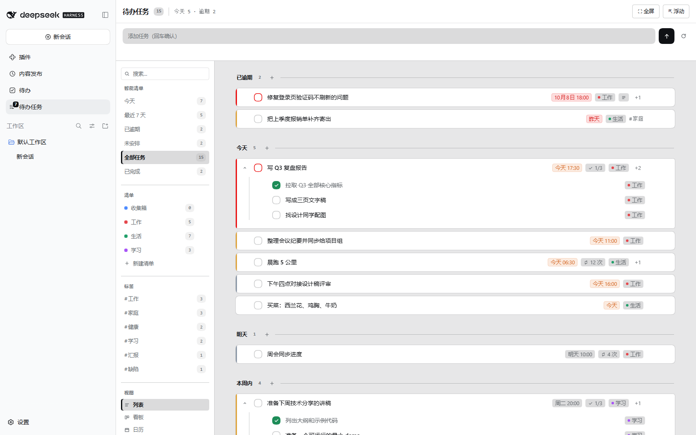
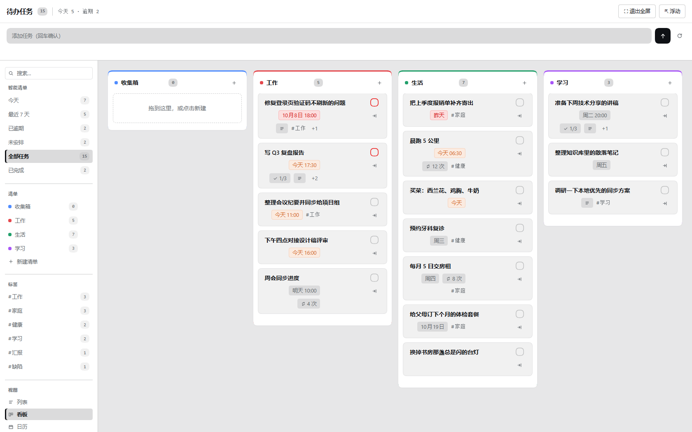
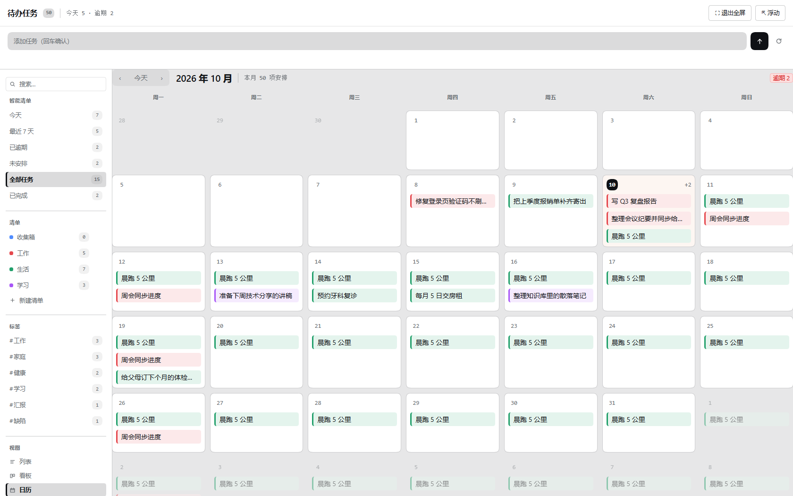
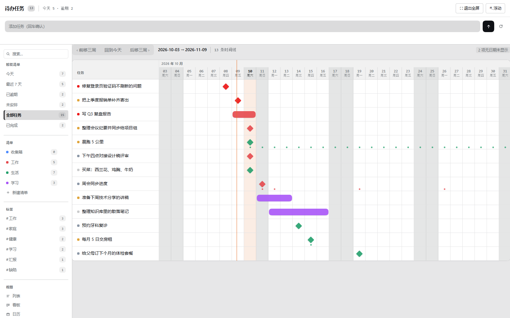
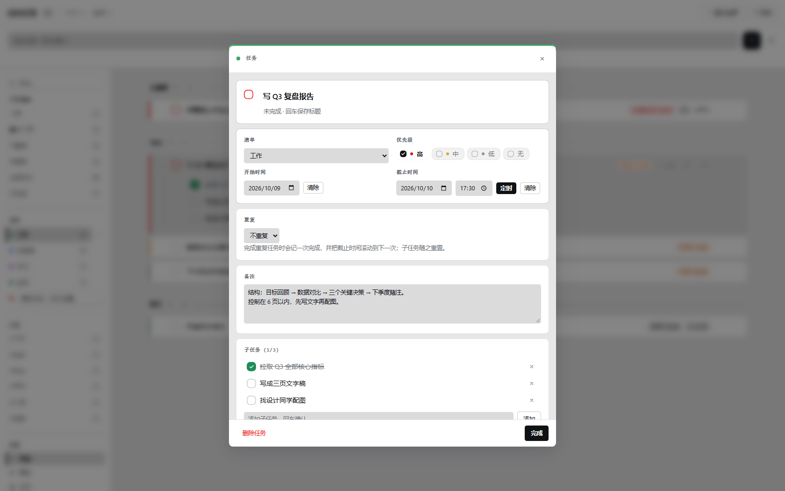
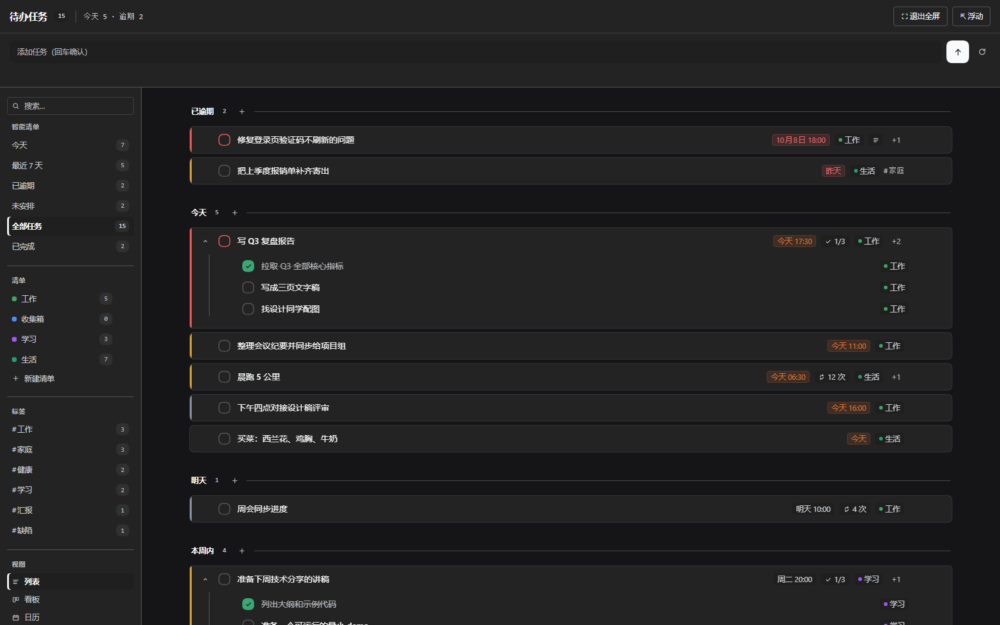
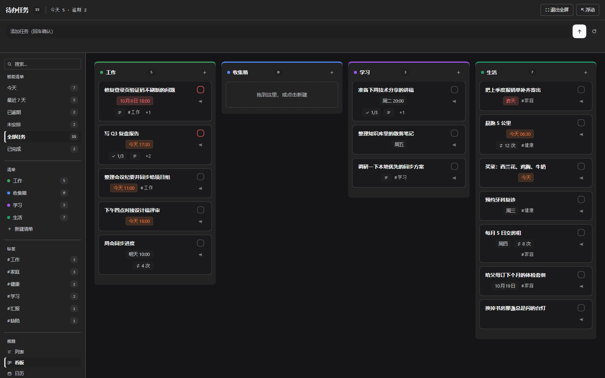
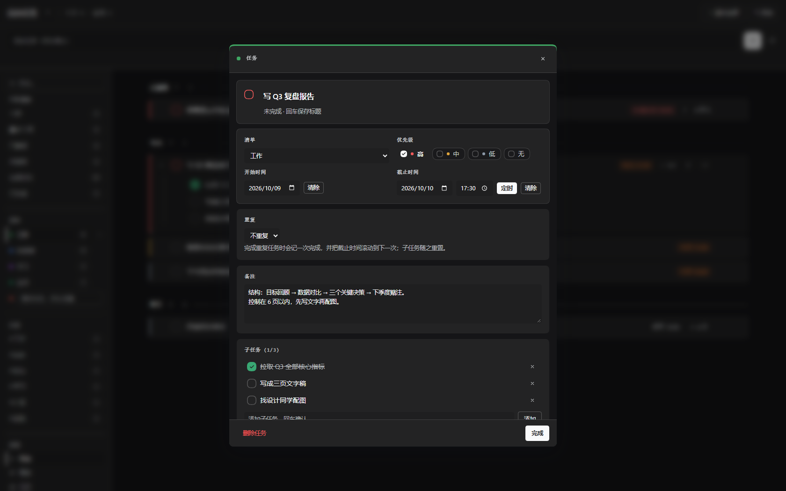

<h1 align="center">dsh-task-todo · 待办任务</h1>

<p align="center">在 DSH 里管理你的任务：四种视图、子任务与备注、每日/每周/每月重复，<br>
并且同一份数据对 agent 开放为工具与斜杠命令。</p>

<p align="center">
  <a href="./LICENSE"></a>
  <a href="https://github.com/deepseek-ai/deepseek-harness"></a>
  
</p>

---

## 它做什么

侧边栏在「新建会话」和「工作区」之间多出一个「待办任务」入口，点开即用主面板里的完整任务页；
再点一次同一个入口就收起、回到会话。同一份数据也是 agent 可读写的工具集。任务是全局的
（不是按会话分库），所以你早上加的任务，下午在另一个会话里依然在。

| 能力 | 说明 |
| --- | --- |
| 浮窗 | 一个可拖到页面任意位置、可拉伸大小的独立小窗口，专门用来一边看会话一边盯任务清单；它只放"我该看哪些任务"的控件，视图切换与清单管理仍留在面板里。详见下一节 |
| 四种视图 | 列表（按 逾期/今天/明天/本周/以后/未安排 分组）、看板（列 = 清单，可拖拽换清单）、日历（月网格，重复任务出现在每个发生日）、甘特图（`start` → `due` 区间，可前后翻页）。切换器在左侧栏的「视图」分组里，窄宽度下自动搬到顶栏 |
| 任务详情 | 点任意任务/子任务从屏幕正中弹出卡片（Esc、点遮罩、点 ✕ 都能关），面板和全屏用的是同一个弹窗 |
| 子任务 | 任意层级，可折叠；每个子任务有自己的备注、优先级、截止时间 |
| 备注 | 任务与子任务都能写多行备注（列表里以图标标记，鼠标悬停看内容） |
| 重复 | 每天 / 每周（可指定周几）/ 每月，支持间隔（每 2 周）、结束条件（到某天 / 共 N 次）；完成一次会滚动到下一次并重置子任务 |
| 快速添加 | 一句话搞定：`明天 15:00 交周报 !高 #工作 @紧要`；输入框下方**实时显示这次回车会创建什么**（标题、截止、重复、优先级、标签、清单，清单不存在时会说明将自动创建）——识别结果来自宿主自己的解析器，所见即所得 |
| 标签 | 左栏「标签」分组列出所有用过的标签与未完成计数，点一下只看该标签；搜索框输入 `#工作` 是同一件事。标签可整体改名（改一次，所有任务跟着变）或清空 |
| 智能清单 | 今天 / 最近 7 天 / 已逾期 / 未安排 / 全部 / 已完成，带实时计数 |
| 清单管理 | 左栏每行一个清单：点齿轮（或选中该行后点）打开居中弹窗，可**改名 / 换颜色 / 上移下移 / 删除**；也能直接拖拽换位置。颜色是 8 个预设色，点一下即生效 |
| 新建清单 | 左栏「清单」分组里直接输入名字回车即建，输入框前的圆点就是它将要得到的颜色（宿主决定的，不是猜的） |
| 数据与备份 | 左侧栏「数据」分组写明数据文件叫什么、在哪儿，并给出一键 导出备份 / 导入恢复 / 复制路径 |
| 飞书多维表格同步 | 把任务（含 完成 / 逾期 / 今天到期 各状态、清单、标签、子任务进度）镜像到一张飞书 Bitable 表；按「任务ID」匹配，重复执行幂等，可 dry-run 预览。详见 [docs/feishu-sync.md](docs/feishu-sync.md) |
| 全屏 | 覆盖整个框架的全屏模式（Esc 退出，再点入口也可收起），切换不丢当前视图与筛选 |
| 侧边栏徽标 | 入口图标右上角显示待办数（口径可在设置里切换：今天 / 逾期 / 未完成） |
| 与 agent 协作 | 7 个工具 + `/todo` 斜杠命令 + 随包分发的技能，天然可对话操作 |

---

## 浮窗

一个**可拖、可拉伸的独立小窗口**，用来一边干别的、一边把任务清单摆在眼前。

- **怎么打开**：面板（或全屏）头部点「⇱ 浮动」；浮动后同一位置变成「⇤ 停靠」和「✕ 关闭」，
  停靠就是把界面交回侧边栏面板，关闭则是收起窗口。`Ctrl+K` 命令面板里也有「浮动窗口 / 停靠回面板」。
  它挂在框架级覆盖层上，所以不会被侧边栏或面板裁切。
- **摆放**：拖头部挪位置，右下角的小三角拉伸尺寸（最小宽度 260px）。
  位置与尺寸记在浏览器本地（`dsh-task-todo:float:v1`），下次打开还在原处——不用每次都重新摆。
- **窗口里只放三件事**：顶部常驻的捕获条（和面板同一个输入框、同一份草稿与预览）、一条「浮窗栏」
  （智能清单页签：今天 / 最近 7 天 / 已逾期 / 未安排 / 全部 / 已完成，带计数，窄了可横向滚）、
  以及清单选择器（每个清单带自己的未完成数）。视图切换、搜索、清单管理、标签与数据块都留在面板里，
  所以这个窗口就是一份清单，不是第二个面板。
- **行在这里是紧凑形态**：只有复选框 + 标题（悬停看完整标题），没有元信息胶囊、没有行尾 ＋ / ×、
  不展开子任务树，行高也更小。窗口只有几百像素宽时，卡片和一堆元信息会把标题挤成一个字一行。
- **它有自己的皮肤**：窗口内单独重指了一层令牌——奶白表面 + 蓝色强调，连复选框的勾都是蓝的
  （不是面板里那个绿色）；蓝色只承担"状态"（当前页签、复选框、你所在的那一行），
  任务标题是窗口里唯一的重色文本，其余都退成发丝线级别的底噪。深色主题下同样成立。
- **同一份数据**：浮窗、侧边栏面板、全屏、agent 的 7 个工具共用同一个数据文件与同一份界面状态，
  在窗口里勾完、回面板看不丢，换个座位也不丢。

---

### 界面



| 看板 | 日历 |
| --- | --- |
|  |  |

| 甘特图 | 任务详情 |
| --- | --- |
|  |  |

| 深色列表 | 深色看板 | 深色任务详情 |
| --- | --- | --- |
|  |  |  |

---

## 安装

前置：已安装 DeepSeek Harness（`dsh`，且 `dsh web` 能跑起来）或 DSH 桌面版，Node ≥ 22。
插件的 client 声明为 `platform: "web"` —— 这是宿主客户端加载器唯一接受的值，所以**同一个包
同时适用于 `dsh web` 与 DSH 桌面版**，不需要为桌面版换一份构建。

### DSH 桌面版（desktop profile）

```sh
# 从 GitHub 安装（桌面 profile 支持 github: 依赖规范）
dsh plugin --profile desktop add "github:vonvonyung/dsh-task-todo"

# 或者指到本地目录（开发形态）
dsh plugin --profile desktop add "<插件目录的绝对路径>"
```

然后**重启桌面版**：bundle 层只在启动时读取。桌面版用自己的窗口加载客户端 bundle，
不必像浏览器那样 `Ctrl+F5`。完整步骤、验证方法与回滚见
[docs/desktop-install.md](docs/desktop-install.md)。

卸载：

```sh
dsh plugin --profile desktop remove dsh-task-todo
```

### Web（`dsh web`）

```sh
# 从 npm 安装（包发布后可用；当前请先 git clone 再指本地目录）
dsh plugin --profile web add dsh-task-todo

# 或者指到本地目录（开发形态）
dsh plugin --profile web add "<插件目录的绝对路径>"
```

然后**重启 `dsh web`**：bundle 层只在启动时读取。带 UI 的插件还要
`Ctrl+F5` 强刷一次浏览器（客户端 bundle 按包路径缓存）。

卸载：

```sh
dsh plugin --profile web remove dsh-task-todo
```

### 数据文件

任务数据默认写在 **`<DSH_HOME>/todo/tasks.json`**（`DSH_HOME` 默认 `~/.dsh`，Windows 下为
`C:\Users\<你>\.dsh`）。web 与 desktop 两套 profile **共用同一个 `DSH_HOME`**，所以两种形态读写的
是**同一份数据**：桌面版里加的任务，`dsh web` 里也在 —— 不需要迁移，也不按 profile 分库。
路径可在 设置 → 插件 → 待办任务 里改（表见下方「配置」）。

## 配置

设置 → 插件 → 待办任务：

| 项 | 默认 | 说明 |
| --- | --- | --- |
| 启用 | 开 | 关闭后工具与界面都不工作 |
| 数据文件 | `<DSH_HOME>/todo/tasks.json` | 留空用默认；改动会重新加载 |
| 默认清单 | 收集箱 | 新增任务未指定清单时的归属 |
| 每周起始日 | 周一 | 只影响日历视图的列顺序 |
| 侧边栏徽标 | 今天 | 今天（今天到期 + 逾期）/ 逾期 / 未完成 |
| 飞书同步 | 关 | 见下一节；启用前不会发起任何网络请求 |

---

## 同步到飞书多维表格

把任务**镜像**到一张飞书 Bitable（多维表格）表，方便在飞书里看板 / 筛选 / 共享。
包括各状态：`状态`（未完成 / 今天到期 / 已逾期 / 已完成）、`完成`、`逾期` 三列，
外加清单、优先级、截止/开始时间、标签、父任务、子任务进度、重复规则与备注。

1. 在 [飞书开放平台](https://open.feishu.cn/app) 建一个**自建应用**，拿到 `App ID` / `App Secret`；
   开通权限 `bitable:app`（多维表格读写），并把应用加进目标多维表格的协作者。
2. 打开目标多维表格，从 URL 里取出 `app_token`（`/base/` 之后那段）与 `table_id`（`table=` 之后那段）。
3. 在表里建一列**文本**字段 `任务ID`（名字可用设置里的 `keyField` 改）——这是匹配已有行的钥匙。
   其余列名见 [docs/feishu-sync.md](docs/feishu-sync.md)，建好后同步会自动写入。
4. 设置 → 插件 → 待办任务 → **飞书同步**：填入 `appId` / `appSecret` / `appToken` / `tableId`，把「启用」打开。
   想让任务变动自动同步，再把「自动同步」打开（防抖 3 秒）。

试跑与排错：

```sh
# 只看配置与上次同步结果（不联网）
/todo sync 状态

# 只计算将要新增 / 更新 / 删除的行，不写远端
/todo sync 预览

# 真正执行
/todo sync
```

Agent 侧是 `task_sync_feishu` 工具（`action=status|sync`，可带 `dryRun` / `prune`）。
按「任务ID」匹配，所以**重复执行是幂等的**；远端那些不带 `任务ID` 的行（别人手写的）不会被删。
表里已经有数据又没有 `任务ID` 列时，同步会**拒绝执行**而不是复制一份。

---

## Skills

| Skill | 用途 |
| --- | --- |
| `todo` | 教模型如何用这 7 个工具、日期与重复约定、快速添加语法、飞书同步入口、以及哪些事不要承诺（例如提醒） |

## MCP servers

无。本插件不依赖外部进程。

## Tools

| 工具 | 参数 | 返回 |
| --- | --- | --- |
| `task_list` | `filter` `list` `query` `includeDone` `includeSubtasks` `today` | 任务列表 + 计数 + 全部清单（含 id/颜色/顺序/任务数）+ 文本摘要 |
| `task_add` | `title` `due` `start` `priority` `list` `tags` `note` `repeat` `repeatInterval` `repeatWeekdays` `repeatUntil` `repeatCount` `parent` | 新任务 |
| `task_update` | `id`(或唯一标题) + 任意可改字段 | 更新后的任务 |
| `task_done` | `id` `undone` | 任务（重复任务会滚动到下一次） |
| `task_delete` | `id` | 被删除的 id（含子任务） |
| `list_manage` | `action`(list/create/update/move/delete) `id`(或唯一清单名) `name` `newName` `color` `index` `delta` | 清单（或清单列表）+ 文本摘要 |
| `task_sync_feishu` | `action`(status/sync) `dryRun` `prune` | 飞书同步状态，或一次同步的 新增/更新/删除/未变 计数 |

`id` 也接受唯一标题；标题不唯一时会拒绝并返回候选，不会替你猜。清单同理：`list_manage`
接受唯一的清单名，删除只删分组、任务移到「收集箱」，系统清单「收集箱」删不掉。

## 斜杠命令

| 命令 | 行为 |
| --- | --- |
| `/todo` | 今天的概览 |
| `/todo add <文本>` | 快速添加 |
| `/todo ls [今天\|本周\|逾期\|未安排\|全部\|已完成]` | 列出任务 |
| `/todo done <id\|标题>` | 完成 |
| `/todo sync` | 同步到飞书多维表格（`/todo sync 状态` 只看配置与上次结果，`/todo sync 预览` 只算差异） |
| `/todo help` | 语法速查 |
